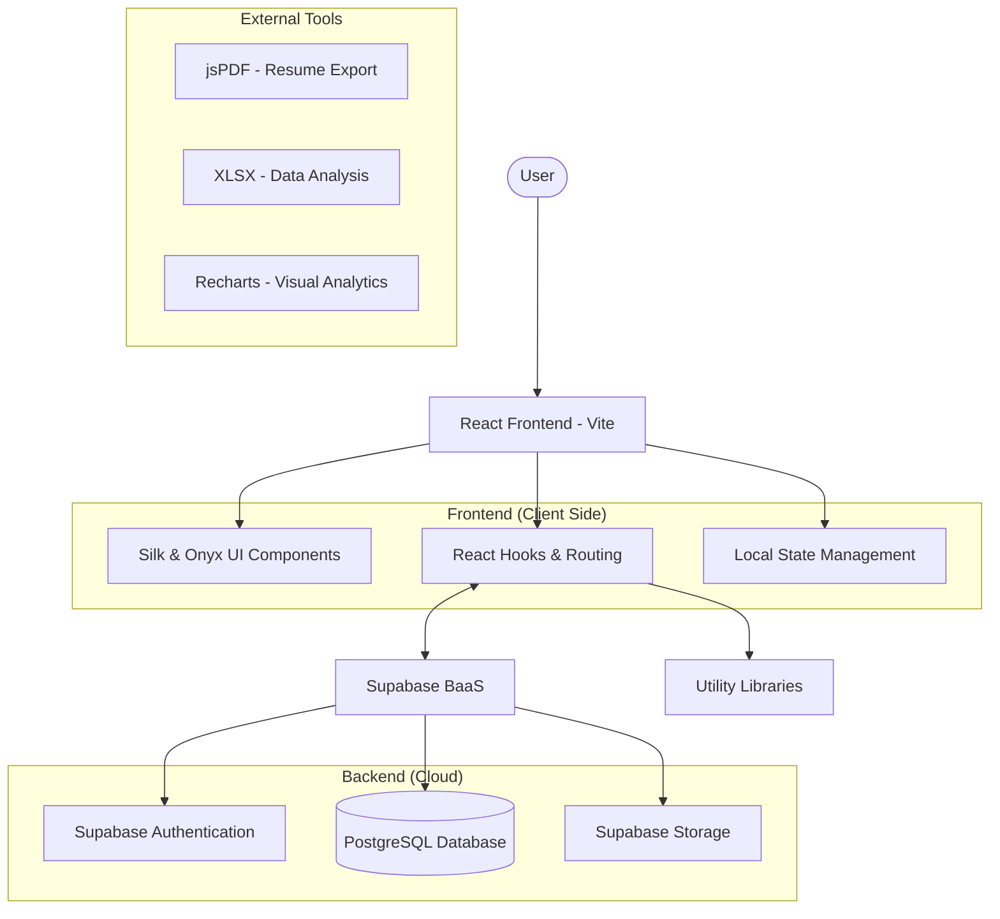

# MapOut - Your Ultimate Career Navigator

MapOut is a comprehensive career guidance and planning platform designed to empower students and professionals in their career journey. With a focus on visual clarity and actionable insights, MapOut provides a suite of tools to help users navigate the transition from education to employment.

---

## ⚡ Problem Statement

The modern job market is increasingly complex and competitive. Many students and early-career professionals face significant challenges:
- **Information Overload:** Career resources are scattered across the web, making it difficult to find reliable guidance.
- **Lack of Structure:** Planning a career path often feels aimless without clear milestones and roadmaps.
- **Inadequate Preparation:** Preparing for interviews and building professional resumes can be overwhelming without the right tools and templates.
- **Resource Management:** Keeping track of researched materials, projects, and bookmarked articles is often disorganized.

## ✨ The Solution

MapOut provides a unified, "Silk & Onyx" designed interface that consolidates essential career development tools into a single platform:
- **Career Planner:** Interactive roadmaps to visualize and track professional milestones.
- **Resume Studio:** A professional resume builder with export capabilities.
- **Interview FAQ Repository:** A curated database of interview questions to boost confidence.
- **Research Guide:** Structural guidance and resources for academic and professional research.
- **Project Showcase:** Tools to manage and display personal and professional projects.
- **Bookmarks:** A centralized system to organize and revisit valuable career resources.

---

## 🏗️ Architecture Diagram



---

## 🛠️ Tech Stack

### Frontend
- **Framework:** [React 18](https://reactjs.org/) with [Vite](https://vitejs.dev/)
- **Styling:** [Tailwind CSS](https://tailwindcss.com/)
- **Components:** [Radix UI](https://www.radix-ui.com/) primitives
- **Animations:** [Framer Motion](https://www.framer.com/motion/) for smooth transitions
- **Icons:** [Lucide React](https://lucide.dev/)

### Backend & Infrastructure
- **BaaS:** [Supabase](https://supabase.com/) (Database & Auth)
- **Database:** [PostgreSQL](https://www.postgresql.org/)
- **Authentication:** Supabase Auth (JWT)

### Utilities
- **Data Export:** `jsPDF`, `html2canvas`, `xlsx`
- **Charts:** `Recharts`
- **Notifications:** `Sonner` (Toasts)

---

## 🚀 Getting Started

1. **Install Dependencies:**
   ```bash
   npm install
   ```

2. **Setup Environment Variables:**
   Create a `.env` file in the root directory and add your Supabase credentials:
   ```env
   VITE_SUPABASE_URL=your_supabase_url
   VITE_SUPABASE_ANON_KEY=your_supabase_anon_key
   ```

3. **Run the Development Server:**
   ```bash
   npm run dev
   ```

4. **Build for Production:**
   ```bash
   npm run build
   ```